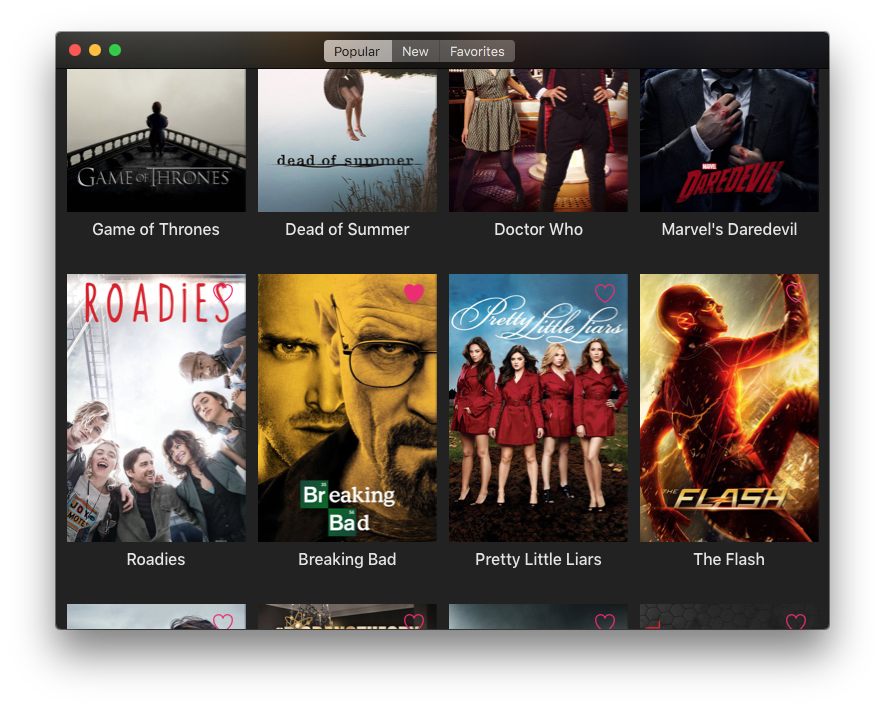
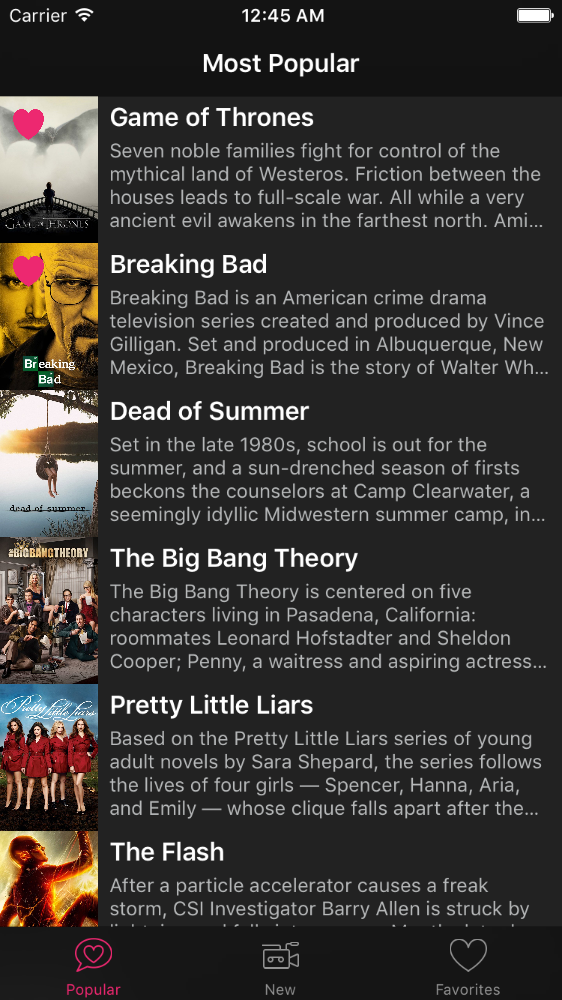

# Binge

This is a sample project for a talk about Mac development for iOS developers. The rest of this readme is in portuguese.

# Binge

Projeto exemplo da minha palestra sobre desenvolvimento pra Mac, voltada a desenvolvedores iOS.

Algumas funcionalidades não estão concluídas, mas o mais importante é observar como o app é estruturado para facilitar a portabilidade do código.

Para compilar o projeto é necessário ter o [CocoaPods](https://cocoapods.org) e rodar `pod install` dentro da pasta do projeto de iOS e dentro da pasta do projeto de macOS.

É necessário uma chave de API do [The Movie DB](https://www.themoviedb.org), renomeie o arquivo `TMDBEnvironment-sample.swift` para `TMDBEnvironment.swift` e coloque sua chave de API nele na constante `apiKey`.

